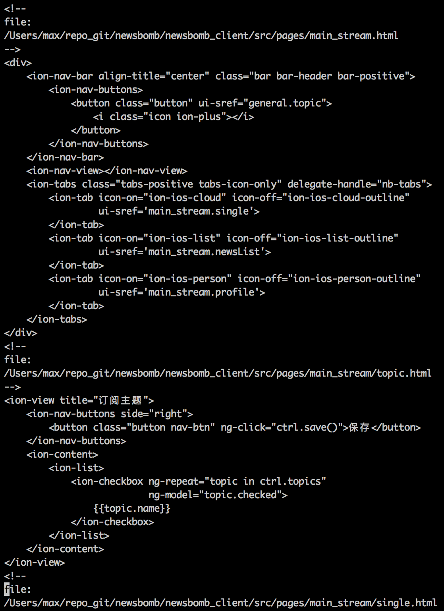

# code-export
A simple code export tool. It can merge all your code from separated files into one.

# Current Supported Code File Suffix
+ .py
+ .js
+ .css
+ .html
+ .cpp
+ .h

# How to use
<code>
$ ./code-export.py YOUR_PROJECT_PATH CODE_OUT_FILE
</code>

# Example
<code>
$ ./code-export.py /Users/max/repo_git/newsbomb/newsbomb_client/src newsbomb_client.out
</code>

# Example Output File
